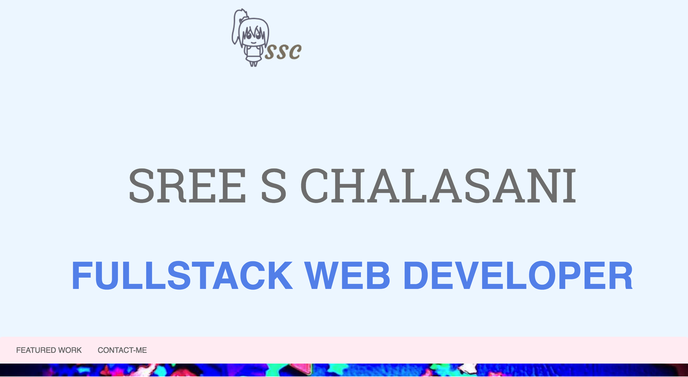

<h1> Build a Portfolio Site </h1>

This is the second project of the Udacity Full-Stack Nanodegree Program. 

<h2> Project Description</h2>
 
 You will be provided with a design mockup as a PDF-file and must replicate that design in HTML and CSS. You will develop a responsive website that will display images, descriptions and links to each of the portfolio projects you will complete throughout the course of your Nanodegree program.
 
   
   <h3> Framework </h3>

Basic framework for a personal portfolio site. Design is responsive.

 
 <h3> Bootstrap  </h3>
 
 
 HTML design using Bootstrap.
 
 
 <h3> Media Queries </h3>
  
  different media queries created for different sizes like phone, tablet and laptop
  
  
  <h3>instructions </h3>

1.Download the design mockup file from the Downloadables section (in the lower right hand corner of your screen, just below this text) and review it.

2.Identify the various boxes you will need to build in order to recreate this design.

3.Write your HTML and CSS files, continue to iterate until your work is representative of the design mockup.

4.Take the time to personalize your portfolio with custom colors, additional content and your own images.

5.Validate your HTML and CSS against the W3C's Validators.

     

